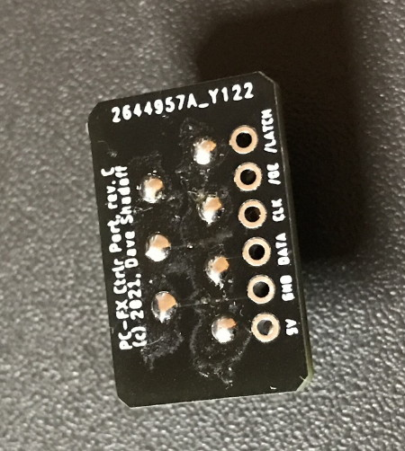
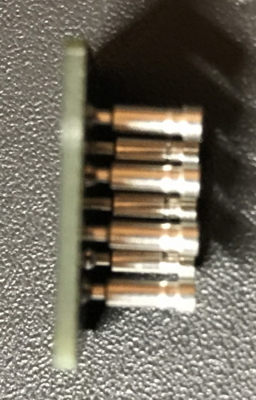

# PCFX Mouse Assembly

## PC Boards and Assembly

I designed all boards using the free version of EAGLE (2-layer, less than 100mm on both X- and Y- axes).
The gerbers are included in this repository, in case you want to get your own set made.

I have included the gerbers and relevant bom.csv and assembly.csv files to get these boards
assembled by JLCPCB, but you will still need the following parts:
- (1) Adafruit KB2040 microcontroller board
- (1) 6-pin right-angle through-hole pin header with 0.1" spacing.
- (7) Mill-Max Manufacturing part number 4401-0-15-80-18-27-04-0 "Receptacle with a standard tail" for creating a custom controller connector.
These are available at Digi-Key/Mouser.

You may also want to use male/female pin header sockets in case you need to remove the microcontroller board.
I recommend using short/low-profile header sockets in this case.

... These boards are solderable along the castellation, which is the recommended approach for assembly.

### Steps to assembly - Connector Board

Soldering the connector has a slightly more complicated process than the microcontroller board.  It's best not to have the pins penetrate all
the way through the board.  This is how I do it:
1. Insert the 7 Mill-Max connector pins into the PC-FX connector; you can use a pair of needle-nose pliers to assist in positioning.
2. Make sure to have one or two strands of speaker wire between the rows of pins; these will be used to extract the connector when
soldering is complete, but this wire should not be soldered to any part of the connector.
3. Position the connector board on top of the pins so that the silkscreen printing is facing up. Allow the pins to penetrate the holes slightly
but try to have them remain nearly flush with the PC board.\

4. Ensure that the empty row of pins (which we will use for the right-angle pin headers) is not so close to the PC-FX; we would not want
them to be shorted by the slightly-visible metal faceplate when inserted.
5. Solder the pins in place
6. Use the wire to carefully extract the connector assembly.\

7. For the right-angle pin header, use angle clippers to remove some of the height of the pins so that they don't emerge through the
other side of the board when inserted.  The board should be 1.6mm thick; roughly 1.2mm-1.5mm of pin should be sufficient.
8. Solder the pin headers into place, with the long end facing inward; these will hold the main board in place.
9. Keep the solder on these holes as flat as possible; there is an opportunity to apply nail polish or some other NON-CONDUCTIVE
coating to ensure that they don't get shorted out by any metal hear the connector socket.

### Steps to assembly - RP2040 Board

1. Position the KB2040 board on the bootom side of the carrier board (where other parts are *NOT* mounted), such that the holes are aligned
(you may wish to use a pin header or two to anchor it in place). The USB-C connector should be at the same end as the USB-A connector
on the other side. Solder the boards together at the castellation.\

2. Insert the headers from the connector board through the holes on the RP2040 board.  Be careful to ensure that the pins are nserted into
the side with the KB2040 board.
This connection should be tight enough that the pins can hold the board in place.
3. With the board positioned roughly midway between the rows of the connector pins, solder the header pins into place.
4. Program the microcontroller board accroudng to the steps in "Programming the Microcontroller Board" below.

### Programming the Microcontroller Board

I have also included a release version of the program as a uf2 file in the releases/ folder.

To put the device into BOOTSEL mode, the board must be rebooted with the 'Boot' button pressed.  This can be done one of two ways:
1. Press and hold the bootsel button (NOT marked as 'RST') while the USB is connected to a computer (and then release after power is applied), OR
2. Connect the USB to a computer, then press and hold this button, and while continuing to hold that button, press and release the button
marked as 'RST' (reset).
The board will reboot in DFU mode, and will present itself as a USB drive to the host PC.

Then, just drag and drop the .uf2 file onto the USB drive which is presented.

