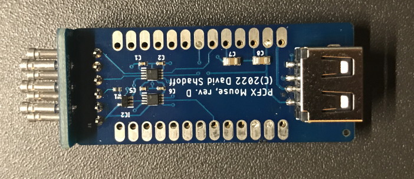
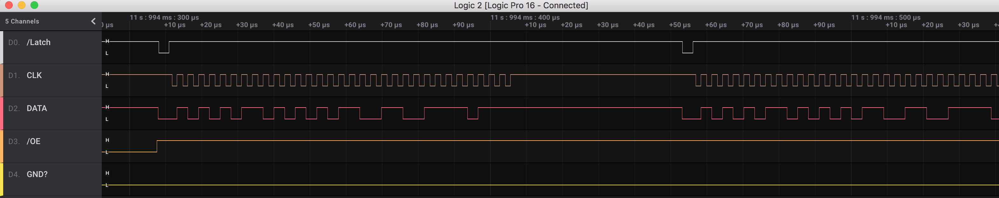

# PC_Engine_RP2040_Projects - PC-FX Mouse converter

## Overview

This project is intended to allow use of a standard USB mouse on a PC-FX.
I have revised this project a few times, and arrived at using an Adafruit KB2040 microcontroller board, as it uses the
excellent RP2040 microcontroller, and due to its breakout of the USB lines, which allows for an external USB-A connector.

## PC Board and Assembly

I designed all boards using the free version of EAGLE (2-layer, less than 100mm on both X- and Y- axes).
The gerbers are included in this repository, in case you want to get your own set made.

I have included the gerbers and relevant bom.csv and assembly.csv files to get these boards
assembled by JLCPCB, but you will still need the following parts:
- (1) Adafruit KB2040 RP2040 microcontroller board
- (7) pieces of Mill-Max pin&socket connector, Part number 4401-0-15-80-18-27-04-0

Optional:
- (2) 13-pin headers.  You may also want to use female pin header sockets in case you need to remove the microcontroller board.
I recommend using short/low-profile header sockets in this case.

There are two PC Boards in this assembly; one functions as part of the host connector.
For that PC Board, you will need the Mill-Max pin&socket connectors.

The way I assembled it was to carefully put the pin connectors on their respective pins, then
position the PC board over top, and solder in place.

Steps to assembly:

See the Assembly Guide
**[See the Assembly Guide](Assembly.md)**

## Source Code

### Compilation

This was built using Pico-SDK version 1.4.0 .
pico_sdk_import.cmake is from the SDK, but is required by CMake (and thus replicated here).

This is based on the TinyUSB Host HID example, and since this often changes (required by refactoring of
the Host HID code), the initial commit baseline is the source ocde of that example.

To build the source, first ensure that you have the right version of the RaspberryPi/piso-sdk installed.
As this board targets the Adafruit KB2040 board, you should run the build_kb2040.sh script (under UNIX).
Then, "cd build" and "make".

I have also included a release version of the program as a uf2 file in the releases/ folder; just drag and drop it
onto the virtual drive presented when putting the board into BOOTSEL mode (holding the 'boot' button, connect the
board by USB to a host computer, and release the button; a new drive should appear on the computer).

### Theory of Operation

At a high level, this is a multi-processor system, withe the division of work as follows:
- CPU0 : perform USB scanning, accumulate X/Y offsets and button status, and push a word conatining all this to PIO State Machine #1.
At intervals, detect whether the scan interval must be complete (after a certain threshold period).
- CPU1 : watch PIO State Machine #1 for the signal identifying start of scan; set locking to prevent mid-scan updates
- PIO State Machine #1 : Monitor host electrical signals, and send the appropriate bit(s) back to host according to protocol
- PIO State Machine #2 : Watch the trigger line identifying the start of scan, and send the signal back to CPU1

#### PC-FX Mouse/Controller Protocol:

Similar to the NES or SNES, the PC-FX Engine triggers a start-of-read trigger by bringing the LATCH line
low.  The first bit of data is output at this time. After the LATCH signal returns to the high state, each
subsequent bit is sent at the transition of the CLOCK signal to high.

In the below diagram, LATCH is the top trace, CLOCK is the middle trace, and DATA sent back is the bottom trace
(/OE defines the data direction - LOW=Read controller; HIGH=Write to controller:\

The first bit sent is the least significant, and the most significant bit is sent last.  The last byte in
the sequence is a controller type identifier - 0x2F = Mouse, and 0x0F = Joypad.

The below data diagram shows how the data is internally passed to the state machien for output:

    Structure of the word sent to the FIFO from the ARM:
    |00101111|111111bb|xxxxxxxx|yyyyyyyy| (PCFX mouse)
    |00001111|11111111|1m1mdddd|rsbbbbbb| (PCFX joypad)
    
     Where:
      0 = must be zero
      1 = must be one
     MOUSE:
      b = button values, arranged in right/left sequence for PC-FX use
      x = mouse 'x' movement; right is {1 - 0x7F} ; left is {0xFF - 0x80 } -> but send as 1's complement !
      y = mouse 'y' movement; down  is {1 - 0x7F} ;  up  is {0xFF - 0x80 } -> but send as 1's complement !
    
     NOTES:
      - PC-FX left/right is (-/+) (but sent as complement - i.e. sned 0xFF if value is zero)
      - PC-FX up/down is (-/+) (but sent as complement - i.e. sned 0xFF if value is zero)
